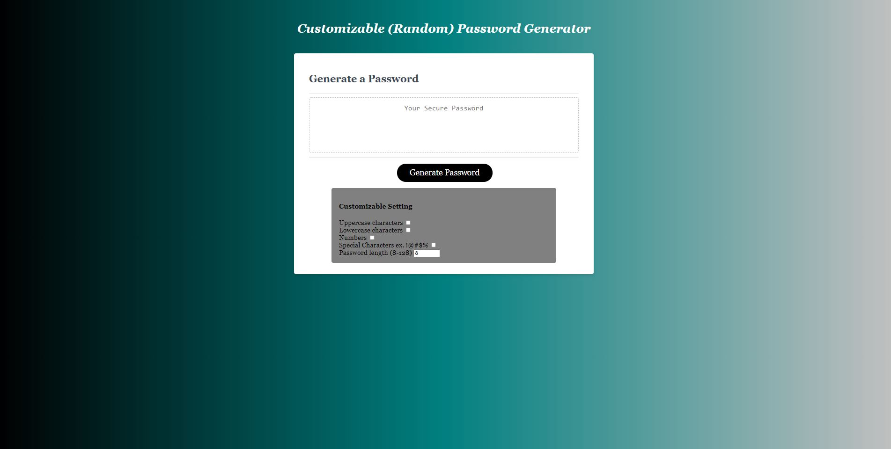

# Customizable (Random) Password Generator

**Version 1.0.0**

## Got Passwords?

    This application is designed to generate a unique password for users. Once identifying the types of character and how many (restricted to 8-128 characters), the 'generate password' button will execute multiple functions and a loop to serve the user with their very own password. 

## Img

   

## Built With...

    JAVASCRIPT
    HTML
    CSS

## Contributor

    Richie Tauch

## Website Link

    https://rumtikitum.github.io/PW-Generator/

